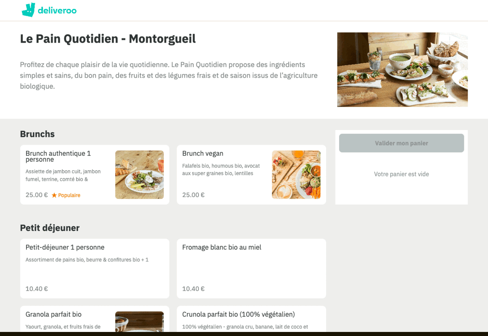
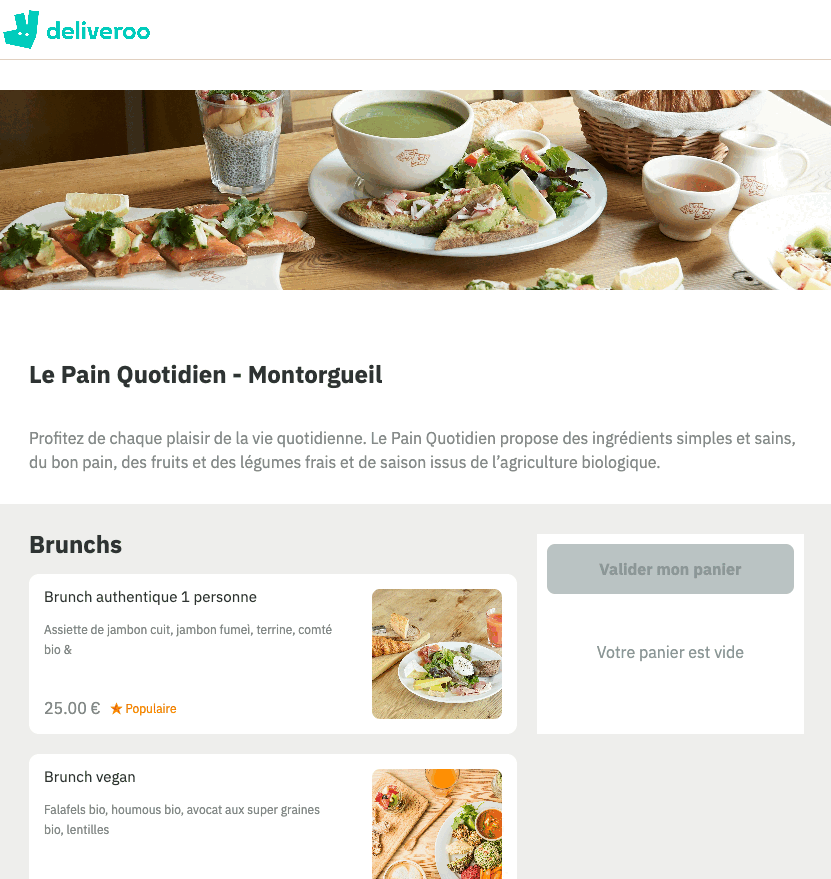
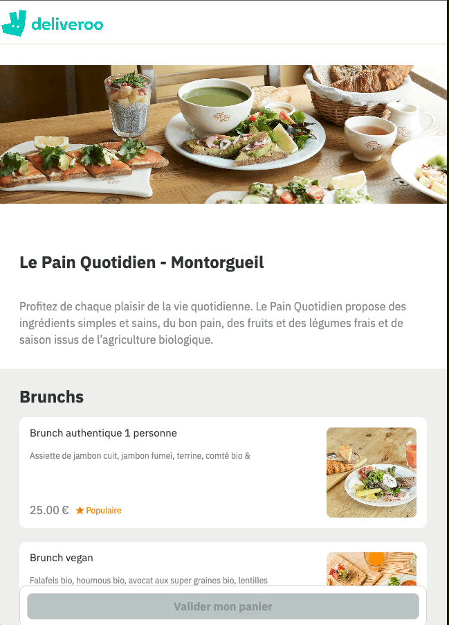

# Deliveroo - Frontend

Deliveroo app is a simplified version of deliveroo website. the backend API of the app can be found here : https://github.com/btboubacar/deliveroo-backend.

## Used technology

- React

## Features:

1. Viewing meals per type
2. Viewing options under each meal type
3. Handling the cart
4. website is **fully responsive**

## Installation

get the repository

```bash
$ git clone https://github.com/btboubacar/deliveroo-frontend
```

enter the directory

```bash
$ cd deliveroo-frontend
```

install the dependencies

```bash
$ yarn
```

## Screen captures

<div>

</div>
<div style= "display: flex; flex-direction: column; align-items: center; gap : 10px">


</div>
